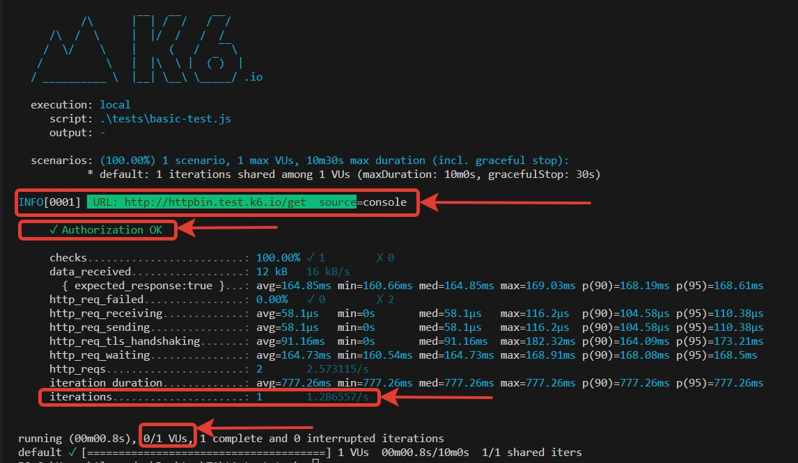
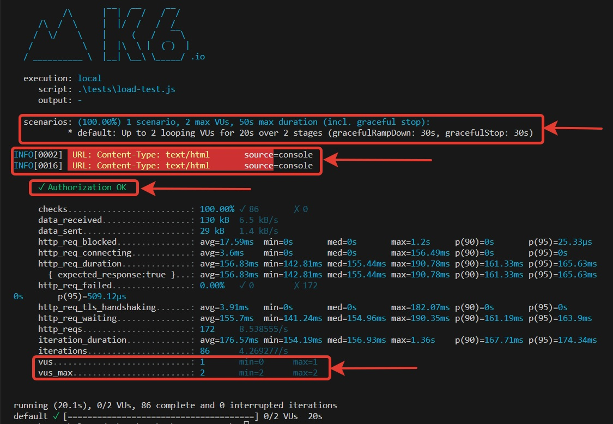

# t1-consulting


# Установка:

### 1. Склонируй проект ```git@github.com:Lexlife/t1-consulting.git```

### 2. Установи k6 ```https://k6.io/docs/get-started/installation/```

# Выполнение сценариев:

### Сценарий 1. Введи в терминале Bash команду ```k6 run .\tests\basic-test.js```

### Сценарий 2. Введи в терминале Bash команду ```k6 run .\tests\load-test.js```

# Ожидаемые результаты:

### Сценарий 1:


### Сценарий 2:


# Альтернативный вариант решения данной задачи
### Помимо предложенного способа, данную задачу можно реализовать через настройки сценариев с использованием ключа "scenarios"

### Пример:
```
export const options = {
  scenarios: {
    basic_test: {
      // name of the executor to use
      executor: 'shared-iterations',
      
      // executor-specific configuration
      vus: 1,
      iterations: 1,
    },
    load_test: {
      stages: [
        { duration: '10s', target: 0 },
        { duration: '10s', target: 2 },
      ]
    },
  },
};

```