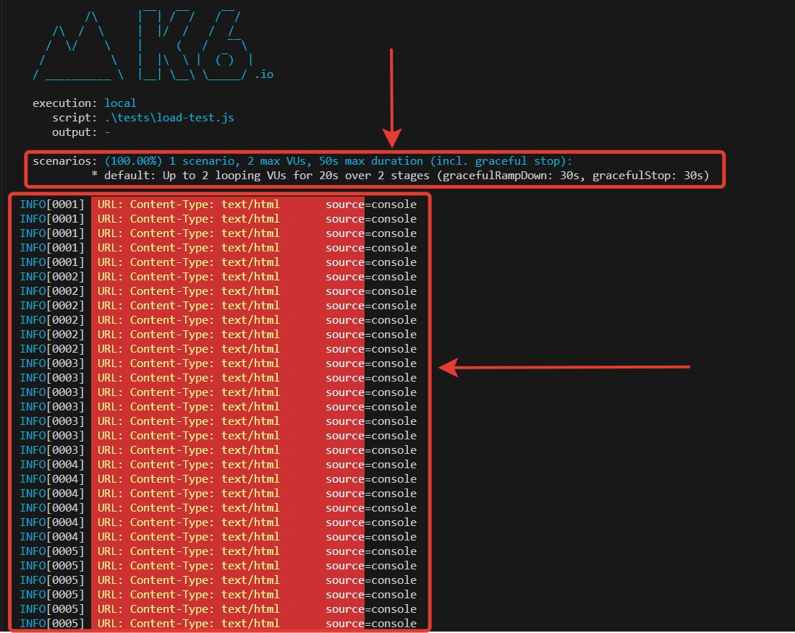
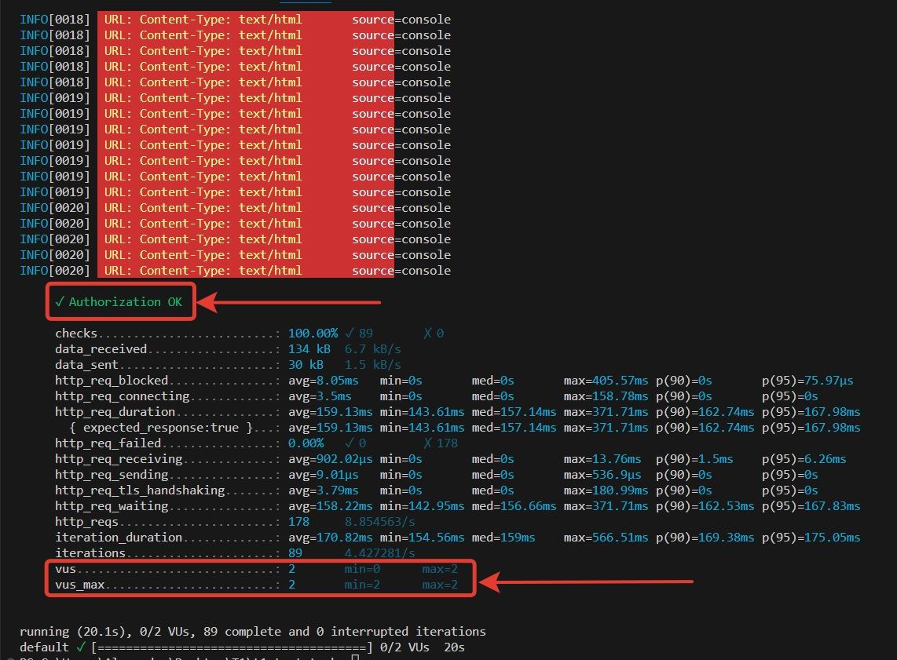

# t1-consulting


# Установка:

### 1. Склонируй проект ```git@github.com:Lexlife/t1-consulting.git```.

### 2. Установи k6 ```https://k6.io/docs/get-started/installation/```.

# Выполнение сценариев:

### Сценарий 1. Введи в терминале Bash команду ```k6 run .\tests\basic-test.js```.

### Сценарий 2. Введи в терминале Bash команду ```k6 run .\tests\load-test.js```.

# Ожидаемые результаты:

### Сценарий 1:


### Сценарий 2:

